# Project 4: Data Analysis Pipeline with Python and Pandas (macOS)

<!-- markdownlint-disable MD033 MD029 MD010 MD007-->
<!-- TOC -->

- [Project 4: Data Analysis Pipeline with Python and Pandas macOS](#project-4-data-analysis-pipeline-with-python-and-pandas-macos)
    - [MacOS Install GuidellGuide'>MacOS Install Guide](#macos-install-guidellguidemacos-install-guide)
        - [Validate Homebrew installedstalled'>Validate Homebrew installed](#validate-homebrew-installedstalledvalidate-homebrew-installed)
        - [Install PythonllPython'>Install Python](#install-pythonllpythoninstall-python)
            - [Install Python using Homebrewmebrew'>Install Python using Homebrew](#install-python-using-homebrewmebrewinstall-python-using-homebrew)
            - [Verify the Python installationlation'>Verify the Python installation](#verify-the-python-installationlationverify-the-python-installation)
            - [Install pip Python package managerger'>Install pip Python package manager](#install-pip-python-package-managergerinstall-pip-python-package-manager)
            - [Verify pip3 versionversion'>Verify pip3 version](#verify-pip3-versionversionverify-pip3-version)
        - [Set Up a Virtual Environmentnment'>Set Up a Virtual Environment](#set-up-a-virtual-environmentnmentset-up-a-virtual-environment)
            - [Install virtualenvrtualenv'>Install virtualenv](#install-virtualenvrtualenvinstall-virtualenv)
    - [Project SetupectSetup'>Project Setup](#project-setupectsetupproject-setup)
        - [Install Required Python Librariesraries'>Install Required Python Libraries](#install-required-python-librariesrariesinstall-required-python-libraries)
        - [Install Jupyter Notebookotebook'>Install Jupyter Notebook](#install-jupyter-notebookotebookinstall-jupyter-notebook)
        - [Test the SetupheSetup'>Test the Setup](#test-the-setuphesetuptest-the-setup)
    - [Jupyter Password Creationreation'>Jupyter Password Creation](#jupyter-password-creationreationjupyter-password-creation)
        - [Set the passwordassword'>Set the password](#set-the-passwordasswordset-the-password)
        - [Start Jupyter Notebookotebook'>Start Jupyter Notebook](#start-jupyter-notebookotebookstart-jupyter-notebook)
        - [Create notebook.ipynb FileynbFile'>Create notebook.ipynb File](#create-notebookipynb-fileynbfilecreate-notebookipynb-file)
        - [Connect to a Jupyter Server localal'>Connect to a Jupyter Server local](#connect-to-a-jupyter-server-localalconnect-to-a-jupyter-server-local)
    - [Install VS Code Extensionsnsions'>Install VS Code Extensions](#install-vs-code-extensionsnsionsinstall-vs-code-extensions)
        - [Useful VSCode Extensionsensions'>Useful VSCode Extensions](#useful-vscode-extensionsensionsuseful-vscode-extensions)
    - [Additional Notes Optionalional'>Additional Notes Optional](#additional-notes-optionalionaladditional-notes-optional)
        - [To shut down Jupyter Notebookebook'>To shut down Jupyter Notebook](#to-shut-down-jupyter-notebookebookto-shut-down-jupyter-notebook)
        - [Notes on Jupyter Kernel Selectionction'>Notes on Jupyter Kernel Selection](#notes-on-jupyter-kernel-selectionctionnotes-on-jupyter-kernel-selection)
        - [GitHub Copilot Extensiontension'>GitHub Copilot Extension](#github-copilot-extensiontensiongithub-copilot-extension)
        - [Install VS Code in your Shell for Macac'>Install VS Code in your Shell for Mac](#install-vs-code-in-your-shell-for-macacinstall-vs-code-in-your-shell-for-mac)
        - [To create a Jupyter config, follow these steps optionalTo create a Jupyter config, follow these steps optional](#to-create-a-jupyter-config-follow-these-steps-optionalto-create-a-jupyter-config-follow-these-steps-optional)
    - [Code Runner change python to python3](#code-runner-change-python-to-python3)

<!-- vscode-markdown-toc-config
	numbering=true
	autoSave=true
	/vscode-markdown-toc-config -->
<!-- /vscode-markdown-toc -->

## MacOS Install GuidellGuide'></a>MacOS Install Guide

### Validate Homebrew installedstalled'></a>Validate Homebrew installed

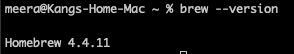

### Install PythonllPython'></a>Install Python

Ensure Python 3 is installed (preferably version 3.8 or higher).

#### Install Python using Homebrewmebrew'></a>Install Python using Homebrew

```bash
brew install python
```

#### Verify the Python installationlation'></a>Verify the Python installation

```bash
python3 --version
```

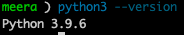

#### Install pip (Python package manager)ger'></a>Install pip (Python package manager)

```bash
python3 -m ensurepip --upgrade
```

#### Verify pip3 versionversion'></a>Verify pip3 version

```bash
pip3 --version
```

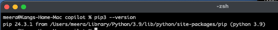

### Set Up a Virtual Environmentnment'></a>Set Up a Virtual Environment

A virtual environment isolates dependencies for your project.

#### Install virtualenvrtualenv'></a>Install virtualenv

```bash
pip3 install virtualenv
```

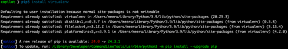

## Project SetupectSetup'></a>Project Setup

- Create a virtual environment for the project:

```bash
mkdir -p copilot/copilot-companion/projects/expense-tracker/java-spring-boot
cd copilot/copilot-companion/projects/expense-tracker/java-spring-boot
python3 -m venv data_pipeline_env
```

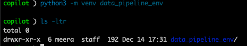

- Activate the virtual environment:

```bash
source data_pipeline_env/bin/activate
```

### Install Required Python Librariesraries'></a>Install Required Python Libraries

Install the libraries needed for the project.

Create a requirements.txt file with the following content

> [!TIP]
> If you clone the project, this file is already provided. You can copy or drag and drop it.
>

```text
pandas
matplotlib
seaborn
jupyter
radon
flake8
black
pandas-profiling
```

```bash
pip3 install -r requirements.txt
```

### Install Jupyter Notebookotebook'></a>Install Jupyter Notebook

Jupyter Notebook will be used to write and present the summary report.

Install Jupyter Notebook:

```bash
pip3 install notebook
```

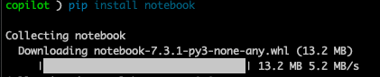

Optionally upgrade pip if needed

```bash
data_pipeline_env/bin/python3 -m pip install --upgrade pip
```

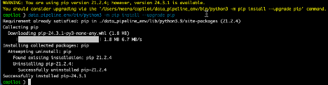

Verify installation

```bash
jupyter --version
```

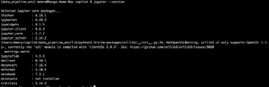

Verify Jupyter exist

```bash
pip3 list | grep jupyter
```

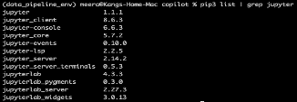

### Test the SetupheSetup'></a>Test the Setup

Create a new Python script to test your environment:

> [!TIP]
> If you clone the project, this file is already provided. You can copy or drag and drop it.

```bash
touch test_pipeline.py
```

Open the script in VSCode using the terminal using the below command or directly from VSC:

```bash
code test_pipeline.py
```

Add the following lines of code to test Pandas and Matplotlib:

```python
import pandas as pd
import matplotlib.pyplot as plt

print("Pandas and Matplotlib are working!")
```

Run the python code

```bash
python3 test_pipeline.py
```

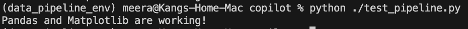

## Jupyter Password Creationreation'></a>Jupyter Password Creation

### Set the passwordassword'></a>Set the password

To create a password for a Jupyter Notebook server, you can use the jupyter notebook password command:
Run the command

```bash
jupyter notebook password
```

Enter and confirm your password

The hashed password will be saved in the `jupyter_notebook_config.json` file. You can use this password to log in instead of a token.

### Start Jupyter Notebookotebook'></a>Start Jupyter Notebook

Launch Jupyter Notebook from the terminal:

```bash
jupyter notebook .
```

When prompted enter your password.
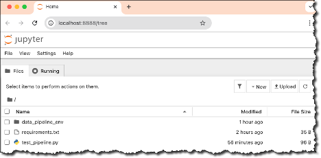

### Create notebook.ipynb FileynbFile'></a>Create `notebook.ipynb` File

Click Code

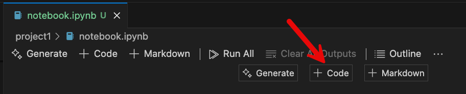

Add a `print("Hello World)` in the code block

Click Run

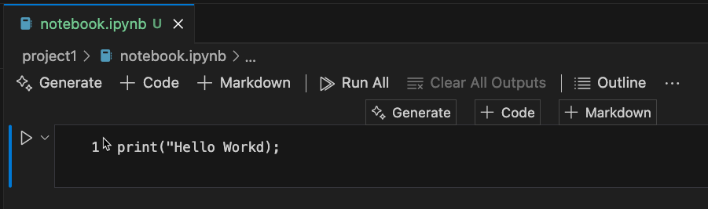

### Connect to a Jupyter Server (local)al'></a>Connect to a Jupyter Server (local)

Connect to a Jupyter Server (local)
To connect to a remote Jupyter server:

Open the Kernel Picker button on the top right-hand side of the notebook (or run the Notebook: Select Notebook Kernel command from the Command Palette).


Select Another Kernel

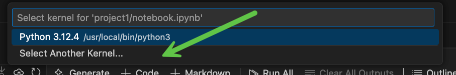

Select Existing Jupyter

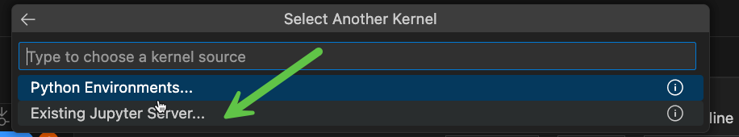

Enter <http://localhost:8888/>

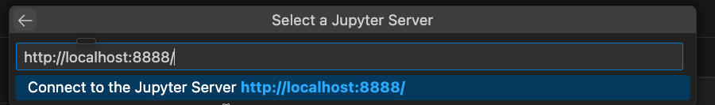

Enter Jupyter Password and Enter

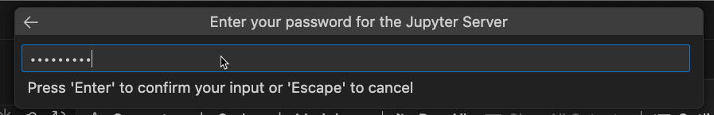

Confirm localhost (Enter again)

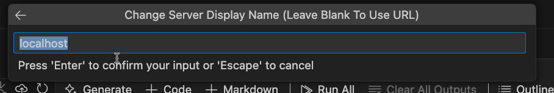

Select(ipykernel) - when prompted install the ipykernel for VS Code

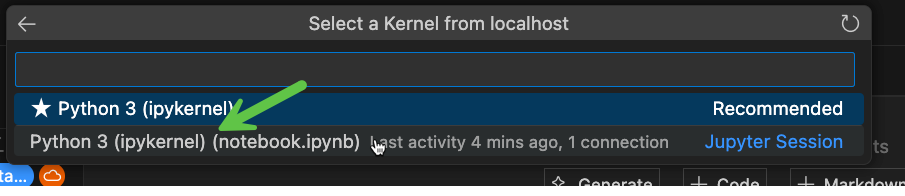

Execute Cell by clicking the Run button in Jupyter Notebook

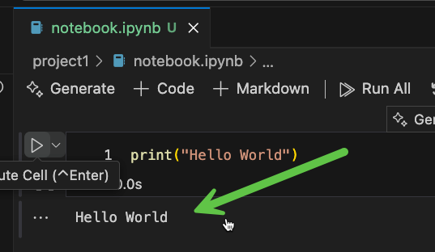

## Install VS Code Extensionsnsions'></a>Install VS Code Extensions

### Useful VSCode Extensionsensions'></a>Useful VSCode Extensions

- Jupyter
- Python
- Data Wrangler
- Code Runner (Optional)
- GitHub Copilot
- GitHub Copilot Chat
- Python Analysis Tool (Optional)

## Additional Notes (Optional)ional'></a>Additional Notes (Optional)

### To shut down Jupyter Notebookebook'></a>To shut down Jupyter Notebook

Press Ctrl+S
Shut down this Jupyter server (y/[n])? Y

### Notes on Jupyter Kernel Selectionction'></a>Notes on Jupyter Kernel Selection

1. Activate your venv
2. Install ipykernel if needed
3. Select the Python3 ipykernel within VSCode

### GitHub Copilot Extensiontension'></a>GitHub Copilot Extension

- Open VSCode and go to the Extensions view (Cmd+Shift+X).
- Search for GitHub Copilot and install the extension.
- Authenticate your GitHub account to enable Copilot.

### Install VS Code in your Shell for Macac'></a>Install VS Code in your Shell for Mac

- Go to the top of VS and select menu View → Command Palette...
- Open the Command Palette via ⌘⇧P and type the shell command to find the Shell Command:

```text
Shell Command: Install `code` command in PATH
```

### To create a Jupyter config, follow these steps (optional)</a>To create a Jupyter config, follow these steps (optional)

1. Open a terminal.
2. Run the following command to generate a Jupyter configuration file:

    ```bash
    jupyter notebook --generate-config
    ```

3. Open the generated configuration file. The default location is `~/.jupyter/jupyter_notebook_config.py`.
4. Uncomment and modify the following lines to set a password:

    ```python
    c.NotebookApp.password = 'sha1:your_hashed_password'
    ```

5. To generate the hashed password, run the following command in the terminal:

    ```bash
    from notebook.auth import passwd
    passwd()
    ```

6. Copy the generated hashed password and paste it into the `NotebookApp.password` field in the configuration file.
7. Save the configuration file.

Now, when you start Jupyter Notebook, it will prompt you for the password you set.

## Code Runner change python to python3

Change the settings.json executor Map location

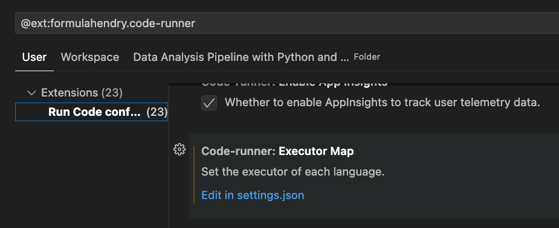

"code-runner.executorMap.python": {...
"python": "python3 -u",
...}

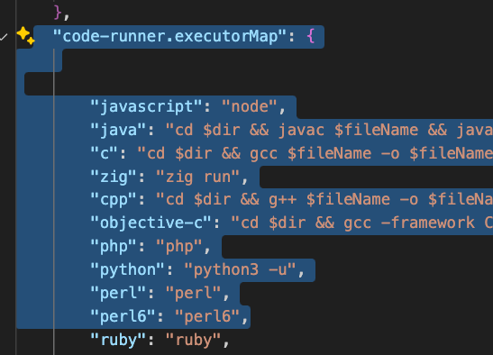
